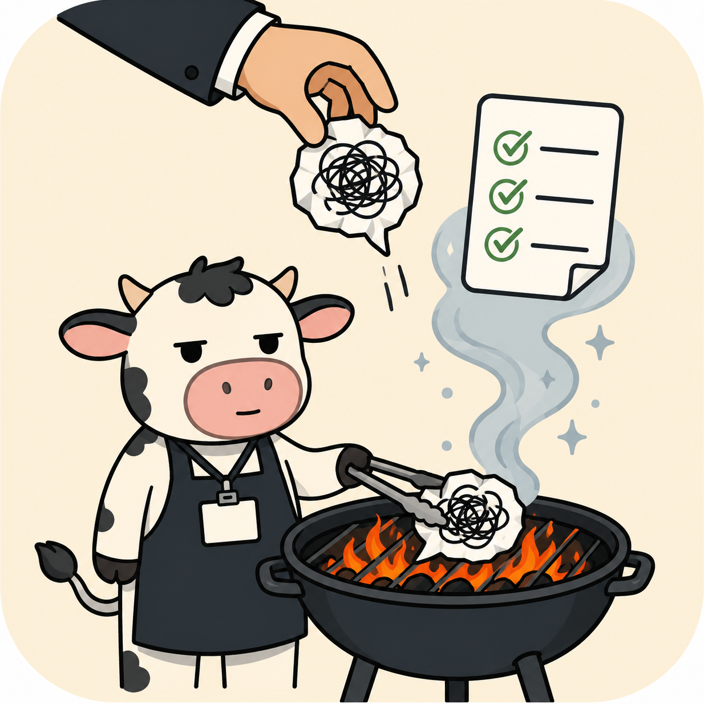

<div align="center">



<h1>grill-boss</h1>

<p><strong>把领导的模糊需求，拷问成可执行、可落地的方案。</strong></p>

<p>
  
  
  
</p>

<blockquote>
<p>拷问的不是领导，是需求本身。<br>
领导不在对话里、去问一次成本很高——所以它替你把问题想全、把事实查好，<br>
把只有领导能拍板的事压成一张"10 秒勾选"的请示清单，剩下的全部自己扛。</p>
</blockquote>

</div>

## 你是否也经历过

- 领导的需求只有一句话，但你交的方案要对十个没人问过的问题负责
- 鼓起勇气去问，得到："你先弄个初稿看看"
- 初稿交上去："方向不对，重写"
- 让 AI 帮忙写方案？它比你更敢编：编数字、编背景、编领导的意图

最后一条，是 grill-boss 直接治的病。

## 它怎么干活

### 1. 需求是一棵树，先挖树根 🌳

领导的原话几乎从不等于真实需求。第一轮永远先问意图层：为什么**现在**提？成果给**谁**看？领导心里"成了"长什么样？能动用什么资源？——树根错了，上面枝繁叶茂也全是白搭。

### 2. 问题三分流 🚦

| 去向 | 例子 | 处理 |
|---|---|---|
| **自己查** | 政策原文、兄弟单位做法、今天几号 | 派后台代理去查，绝不烦你 |
| **问你** | 体例格式、工具选型、先后顺序 | 直接问，每题附推荐答案 |
| **问领导** | 真实目的、口径高低、预算、政治考量 | 攒进请示清单，能不问就不问 |

提问按**前沿分轮**：只问前置已定的问题，一轮问完、绝不挤牙膏；下游问题等上游定了再问。十三个问题，三轮问完，不是十三轮。

### 3. 请示清单：让领导 10 秒答完 📋

不超过 5 条封闭式问题，每条给建议选项 + 一句话理由，领导扫一眼勾选即可。能用稳妥默认假设兜住的问题，不配占请示名额。清单末尾自带保命句：

> "若您没空细看，我先按建议项推进，有偏差随时纠正。"

### 4. 假设台账：不记黑账 📒

问不到的决策，不许悄悄写进方案——默认值、选它的依据、猜错的代价，三栏记账，随方案一起交付。方案里出现的每个数字（包括"今天周四"）要么有出处，要么在台账里。领导翻到台账那页，看到的不是漏洞，是你把风险都想到了。

### 5. "急"不是跳过的理由 ⏰

你说"很急，别问了"，它不会从此闭嘴开编——只会把提问压缩成一轮，问完最要命的 3–5 题，其余全部转显式假设。快，但不瞎。

## Before / After

**没有 grill-boss：**

> "好的！以下是《XX 工作方案》：预计提效 40%，核心岗位覆盖率达 80%……"
>
> （这些数字哪来的？它编的。你拿着它去汇报，就是你编的。）

**有 grill-boss：**

> "先别写。领导为什么现在提这个？给谁看？——这 5 个问题你花 2 分钟答；那 4 件只有领导能定的事，我拟成了勾选式清单你带过去；剩下 3 个事实我已经派后台去查了。"

## 安装

复制 `SKILL.md` 到个人技能目录：

```
~/.claude/skills/grill-boss/SKILL.md
```

或作为项目技能放在项目的 `.claude/skills/grill-boss/SKILL.md`。

## 使用

对 Claude 说人话即可自动触发：

- "领导说要搞个 XX，帮我弄一下"
- "老板让我牵头出个方案，下周一汇报"
- "不知道领导到底想要什么"

也可显式召唤："grill boss" 或 "拷问需求"。

## 它靠谱吗

不是拍脑袋写的。按"技能也要 TDD"的路子开发——先让没装技能的 AI 裸奔（果然当场编出一个"使用率 80%"的通用方案），装上技能重测，再针对新漏洞打补丁：

- 抓到它编造"今天周四"没查证 → 补上"日期也算数字，须查系统时间或进台账"
- 用"很急，别问了，先给个初稿也行"双重话术诱惑它 → 顶住了，拒绝初稿、压缩成一轮 5 题

每一条规则背后都有一次被抓现行的测试记录。

## 致谢

设计脱胎于 Matt Pocock 的 batch-grill-me（设计树 + 前沿分轮批量提问 + 事实自查决策留人）。我们给它加上了中国职场的生存智慧：揣摩上意、请示清单、假设台账。

## 免责声明

grill-boss 只能拷问需求，不能保证领导不改主意。"领导中途改主意"已作为默认风险项写入方案契约的"风险与应对"章节——你看，我们连这个都想到了。
